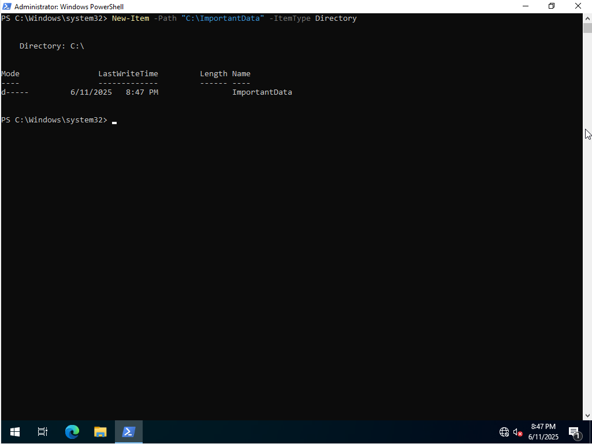
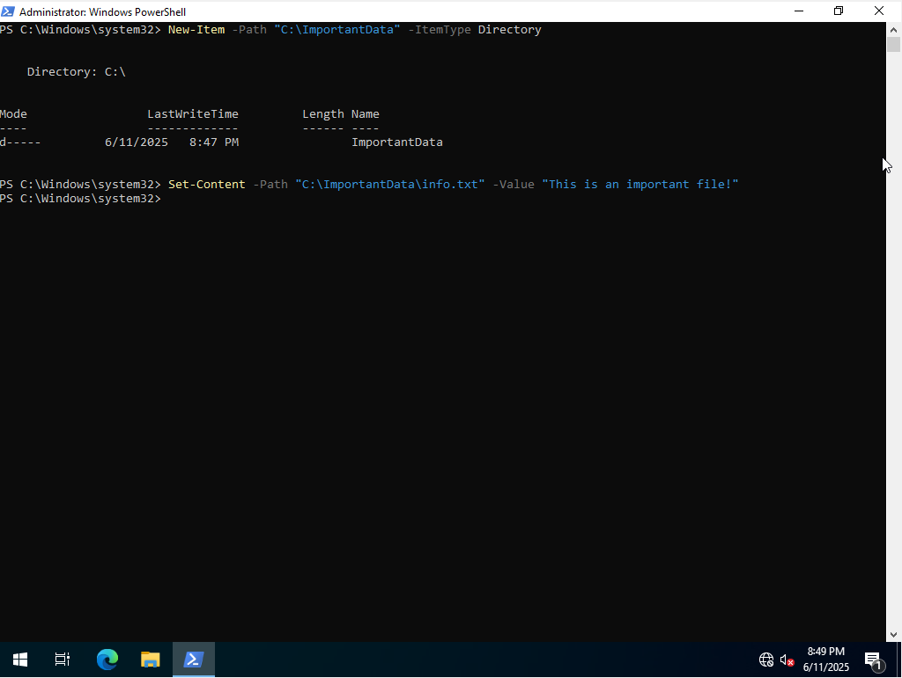
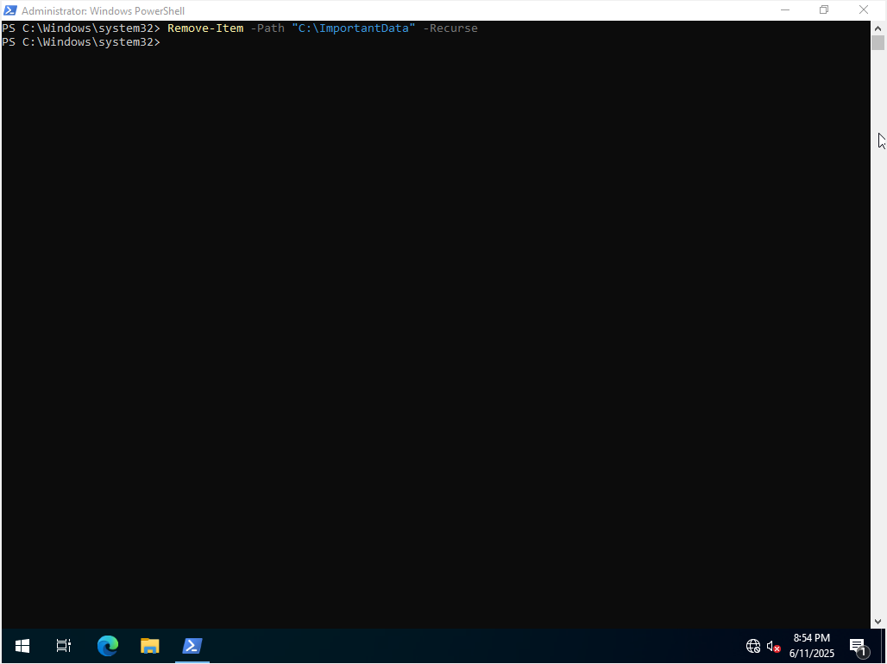
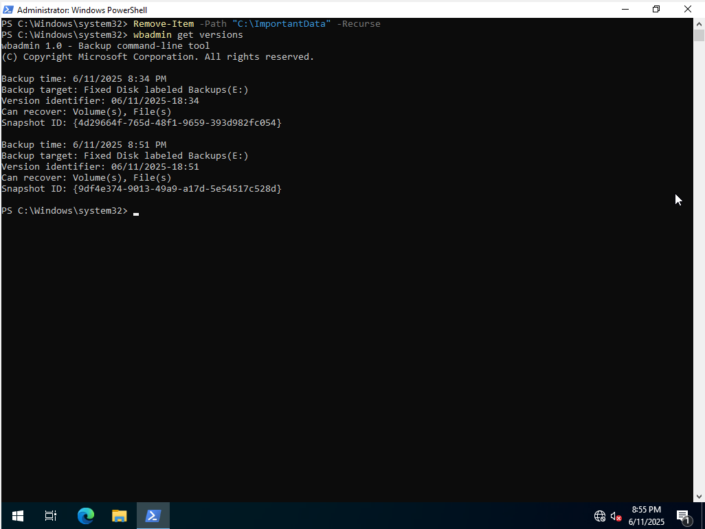
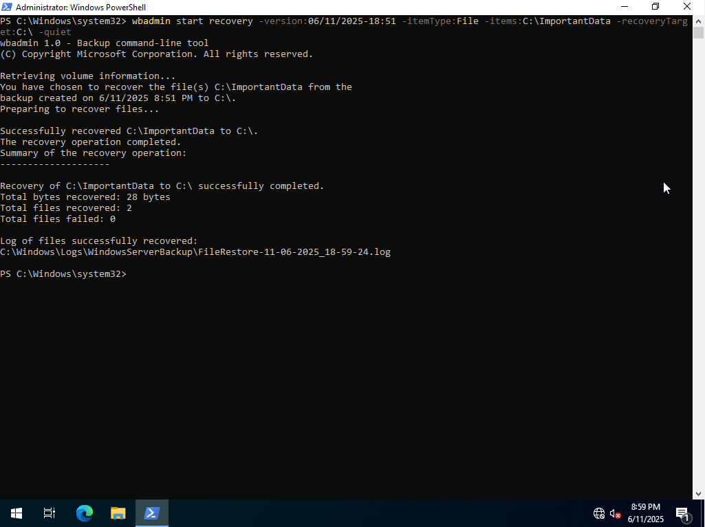

# Windows File Backup and Recovery Lab

This lab demonstrates how to create and restore a file-level backup using `wbadmin` on Windows Server 2022.

The purpose is to simulate a real-world scenario where user data is backed up to a second disk (`E:`) and restored after deletion.

⚠️ **Note**: In production environments, backups should never be stored on the same physical disk as the source files. In this lab, a second virtual disk (`E:`) was added in advance for backup storage.

---

## 🔧 Steps Overview

| Step | Description | Screenshot |
|------|-------------|------------|
| 1 | Create the folder `C:\ImportantData` |  |
| 2 | Create a file inside the folder |  |
| 3 | Delete the folder to simulate data loss |  |
| 4 | List available backups using `wbadmin get versions` |  |
| 5 | Recover the folder using `wbadmin start recovery` |  |

---

## 💻 Commands Used

```powershell
# Create the folder
New-Item -Path "C:\ImportantData" -ItemType Directory

# Create a file in that folder
Set-Content -Path "C:\ImportantData\info.txt" -Value "This is an important file!"

# Start the backup to E:
wbadmin start backup -backupTarget:E: -include:C:\ImportantData -quiet

# Delete the folder
Remove-Item -Path "C:\ImportantData" -Recurse

# Check available backup versions
wbadmin get versions

# Restore the folder (replace with your actual version)
wbadmin start recovery -version:06/11/2025-18:51 -itemType:File -items:C:\ImportantData -recoveryTarget:C:\ -quiet

📌 Notes
· OS used: Windows Server 2022 (running in VirtualBox)
· Backup type: File-level backup
· Backup target: Drive E: (a second virtual disk prepared earlier)
· Tool used: wbadmin (Windows Server Backup CLI)

✅ Skills Demonstrated
· Working with PowerShell for file and system operations
· Creating and restoring backups using wbadmin
· Verifying data integrity
· Simulating data loss and recovery in a safe environment
